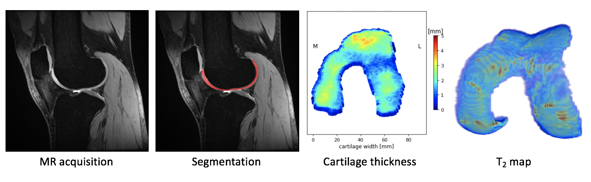

pyKNEEr
================================================================================

|

|

*pyKNEEr* is an image analysis workflow for **open** and **reproducible** research on **femoral knee cartilage**

.. raw:: html

   It is implemented in <a href="https://www.python.org/" target="_blank">python</a> with <a href="http://jupyter.org/" target="_blank">Jupyter notebooks</a>

|

Try *pyKNEEr* on Binder!

.. image:: https://mybinder.org/badge_logo.svg
 :target: https://mybinder.org/v2/gh/sbonaretti/2019_QMSKI_Transparent_Research_WS/master?filepath=pykneer_example%2Fpykneer_example.ipynb

|

.. raw:: html

   <link rel="stylesheet" href="https://cdnjs.cloudflare.com/ajax/libs/font-awesome/4.7.0/css/font-awesome.min.css">
   <a href="https://github.com/sbonaretti/pyKNEEr" target="_blank"><i class="fa fa-github" style="font-size:28px;"></i></a>
   <a href="https://www.biorxiv.org/content/10.1101/556423v1" target="_blank"><i class="fa fa-book" style="font-size:28px;"></i></a>

    
    

    </a>

|
|

.. toctree::
   :maxdepth: 2
   :hidden:

   introduction
   installation
   preprocessing
   segmentation
   morphology
   relaxometry
   faq
