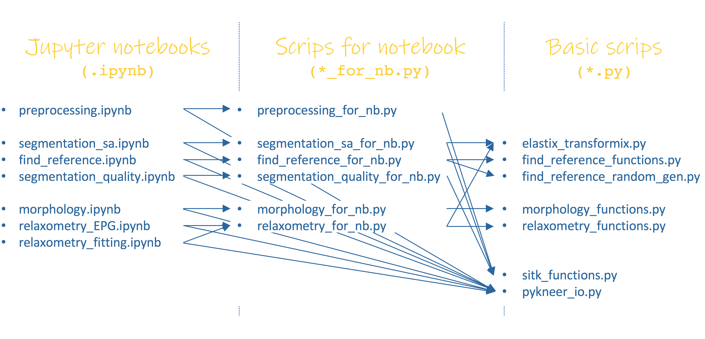

.. _developmnet:

Development
================================================================================

.. note::

    .. raw:: html

        The source code is on  <a href="https://github.com/sbonaretti/pyKNEEr/tree/master/pykneer" target="_blank">GitHub</a>

Code structure
--------------------------------------------------------------------------------
*pyKNEEr* is written in a modular way to favor modifications and extensions. There are three levels of files associated with each step of the workflow:

1. Jupyter notebooks (``.ipynb``) representing both a user-interface and a record of the method and results obtained, to be attached to publications
2. Python scripts for notebooks (``for_nb.py``) containing functions called by the notebook and used to process images and visualize outputs
3. Basic python scripts (``.py``) containing core functions and classes

The figure above shows the code structure. For example, to compute morphology of femoral knee cartilage, the scheme is:

1. ``morphology.ipynb``: Jupyter notebook used to run computations and visualize results. It uses functions from:
2. ``morphology_for_nb.py``: python module that contains functions to calculate knee cartilage morphology and visualize results. It uses functions from:
3. ``morphology_functions.py``: python module that contains the actual algorithms to compute cartilage thickness and volume

Additional packages
++++++++++++++++++++++

*pyKNEEr* uses:

.. raw:: html

   <ul>
    <li><a href="https://github.com/SuperElastix/elastix/wiki" target="_blank">Elastix 4.8</a> for single-atlas segmentation</li>
    <li><a href="https://github.com/xingjiepan/cylinder_fitting" target="_blank">Cylinder fitting</a> to flatten cartilage for visualization</li>
   </ul>

Variable names
--------------------------------------------------------------------------------
When reading the ``.txt`` file at the beginning of each notebook, *pyKNEEr* creates a dictionary (i.e. a struct) called ``image_data``.
In ``image_data``, each cell corresponds to an image and contains an array of strings representing paths, input and output file names, and other information that will be used throughout the whole notebook.

For example, for the :ref:`demo <demo>`  images the content of the first cell of ``image_data`` in  the ``preprocessing.ipynb`` notebook can be printed out using the commands:

.. code-block:: python

   image_data = io.load_image_data_preprocessing(input_file_name)
   image_data[0] # 0 is the ID of the first image

obtaining the following output:

.. list-table::
   :widths: 25 50
   :header-rows: 0

   * - **Folders**
     - **Example**
   * - original_folder
     - /.original/
   * - preprocessed_folder
     - /.preprocessed/
   * - image_folder_file_name
     - 01/DESS/01
   * - **File Names**
     - **Example**
   * - original_file_name
     - ./preprocessed/01_DESS_01_orig.mha
   * - preprocessed_file_name
     - ./preprocessed/01_DESS_01_prep.mha
   * - info_file_name
     - ./preprocessed/01_DESS_01_orig.txt
   * - temp_file_name
     - ./preprocessed/01_DESS_01_temp.mha
   * - **Other Information**
     - **Example**
   * - image_name_root
     - subject1_DESS
   * - laterality
     - right

Changelog
--------------------------------------------------------------------------------

.. raw:: html

    Changes in <i>pyKNEEr</i> are described in the <a href="https://github.com/sbonaretti/pyKNEEr/blob/master/README.md" target="_blank">readMe</a> file of the GitHub repository

Contributing
--------------------------------------------------------------------------------

.. raw:: html

    Thanks so much for contributing!
     
    The easiest way is to fork the repository from <a href="https://github.com/sbonaretti/pyKNEEr" target="_blank">GitHub</a> and then send a pull request.
     
    If you want to coordinate or need any information, do not hesitate to write me at serena dot bonaretti dot research at gmail dot com
